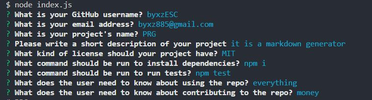

# 09-Node.js-Professional README generator

## Description

It is a simple readme markdown file generator using command prompt.

## Table of Contents (Optional)

- [Installation](#installation)
- [Usage](#usage)
- [License](#license)
- [Contributing](#contributing)
- [Tests](#tests)
- [Questions](#questions)

## Installation

To install necessary dependencies, run the following command: 

    npm i  

## Usage

Step1: run following command in your terminal:
    node index.js 

step 2: type in your information to the prompt
    example:

## License

N/A

## How to Contribute

N/A

## Tests

No written test at the moment.